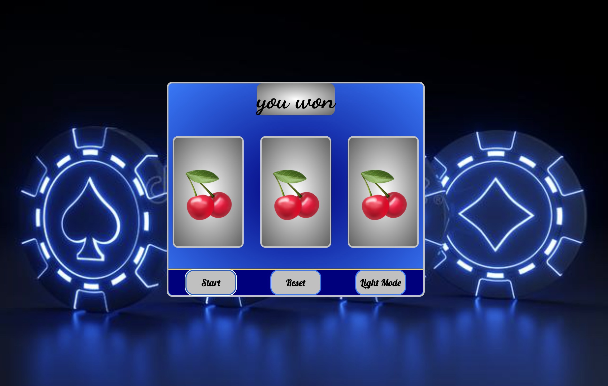

 
# Slot Machine

### Brief History
The original name of the slot machine was known as the  liberty bell.  Legend goes “the slot machine was first invented in 1894 in San Francisco by Charles Fey. To generate the random game combonations, Charles implemented a machine with 3 metal hoops, called reels.

Picture:

## Technologies Used:
#### 1.HTML
#### 2.CSS
#### 3.JavaScript
#### 4.Netlify

# Game Link
[Slot Machine Game](https://hopeful-bell-3d058f.netlify.app/)
 

 
# Future Plans
In the future I plan to add a lever animation 
And also add a Spinning animation to the display so it looks like it's spinning 

